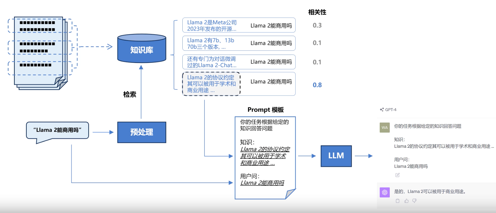
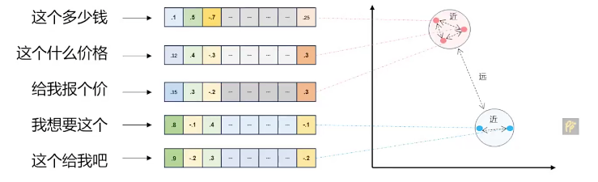
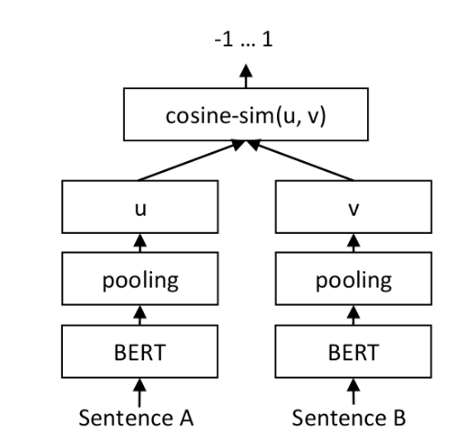
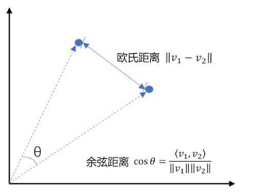
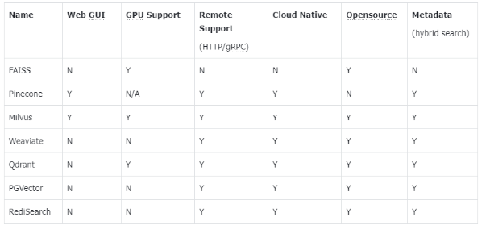
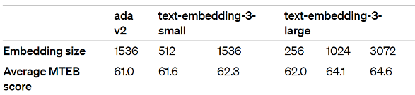
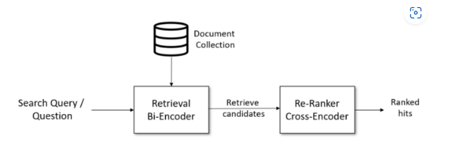
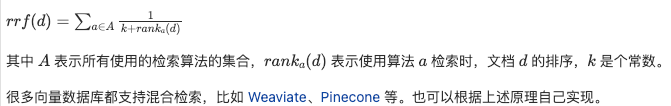
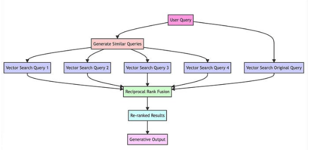
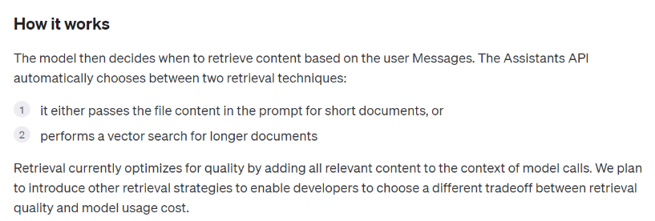

# RAG向量数据库

- 如何使用垂直领域数据补充LLM的能力?
- 如何构建垂直领域(向量)知识库?
- 搭建一套完整的RAG系统需要哪些模块?

## 一、什么是检索增强的生成模型(RAG)

### 1.1 LLM固有的局限性

1. LLM的知识不是实时的
2. LLM可能不知道你私有领域/业务知识

### 1.2 检索增强生成

RAG（Retrieval Augmented Generation）顾名思义，通过检索的方法来增强生成模型的能力



```yaml
类比：你可以把这个过程想象成开卷考试。让 LLM 先翻书，再回答问题。
```

## 二、RAG系统的基本搭建流程

搭建过程：

1. 文档加载，并按一定条件**切割**成片段
2. 将切割的文本片段灌入**检索引擎**
3. 封装**检索接口**
4. 构建**调用流程**：Query -> 检索 -> Prompt -> LLM -> 回复

### 2.1 文档加载与切割

```python
pip
install - -upgrade
openai

# 安装pdf解析库
pip
install
pdfminer.six

from pdfminer.high_level import extract_pages
from pdfminer.layout import LTTextContainer


def extract_text_from_pdf(filename, page_numbers=None, min_line_length=1):
    '''从 PDF 文件中（按指定页码）提取文字'''
    paragraphs = []
    buffer = ''
    full_text = ''
    # 提取全部文本
    for i, page_layout in enumerate(extract_pages(filename)):
        # 如果指定了页码范围，跳过范围外的页
        if page_numbers is not None and i not in page_numbers:
            continue
        for element in page_layout:
            if isinstance(element, LTTextContainer):
                full_text += element.get_text() + '\n'
    # 按空行分隔，将文本重新组织成段落
    lines = full_text.split('\n')
    for text in lines:
        if len(text) >= min_line_length:
            buffer += (' ' + text) if not text.endswith('-') else text.strip('-')
        elif buffer:
            paragraphs.append(buffer)
            buffer = ''
    if buffer:
        paragraphs.append(buffer)
    return paragraphs


paragraphs = extract_text_from_pdf("llama2.pdf", min_line_length=10)

for para in paragraphs[:3]:
    print(para + "\n")
```

### 2.2 检索引擎

es

### 2.3 LLM接口封装

```python
from openai import OpenAI
import os
# 加载环境变量
from dotenv import load_dotenv, find_dotenv

_ = load_dotenv(find_dotenv())  # 读取本地 .env 文件，里面定义了 OPENAI_API_KEY

client = OpenAI()
```

```python
def get_completion(prompt, model="gpt-3.5-turbo"):
    '''封装 openai 接口'''
    messages = [{"role": "user", "content": prompt}]
    response = client.chat.completions.create(
        model=model,
        messages=messages,
        temperature=0,  # 模型输出的随机性，0 表示随机性最小
    )
    return response.choices[0].message.content
```

### 2.4 Prompt模版

```python
def build_prompt(prompt_template, **kwargs):
    '''将 Prompt 模板赋值'''
    prompt = prompt_template
    for k, v in kwargs.items():
        if isinstance(v, str):
            val = v
        elif isinstance(v, list) and all(isinstance(elem, str) for elem in v):
            val = '\n'.join(v)
        else:
            val = str(v)
        prompt = prompt.replace(f"__{k.upper()}__", val)
    return prompt
```

```python
prompt_template = """
你是一个问答机器人。
你的任务是根据下述给定的已知信息回答用户问题。
确保你的回复完全依据下述已知信息。不要编造答案。
如果下述已知信息不足以回答用户的问题，请直接回复"我无法回答您的问题"。

已知信息:
__INFO__

用户问：
__QUERY__

请用中文回答用户问题。
"""
```

### 2.5 RAG Pipeline初探

```python
user_query = "how many parameters does llama 2 have?"

# 1. 检索
search_results = search(user_query, 2)

# 2. 构建 Prompt
prompt = build_prompt(prompt_template, info=search_results, query=user_query)
print("===Prompt===")
print(prompt)

# 3. 调用 LLM
response = get_completion(prompt)

print("===回复===")
print(response)
```

```yaml
扩展阅读：
Elasticsearch（简称ES）是一个广泛应用的开源搜索引擎: https://www.elastic.co/
关于ES的安装、部署: https://juejin.cn/post/7104875268166123528
关于经典信息检索技术的更多细节: https://nlp.stanford.edu/IR-book/information-retrieval-book.html
```

### 2.6 关键字检索的局限性

同一个语义，用词不同，可能导致检索不到有效的结果

```python
# user_query="Does llama 2 have a chat version?"
user_query = "Does llama 2 have a conversational variant?"

search_results = search(user_query, 2)

for res in search_results:
    print(res + "\n")
```

## 三、向量检索

### 3.1 文本向量(Text Embeddings)

1. 将文本转成一组浮点数：每个下标i，对应一个维度
2. 整个数组对应一个n维空间的一个点，即文本向量又叫 Embeddings
3. 向量之间可以计算距离，距离远近对应语义相似度大小



#### 3.1.1 文本向量如何得到

1. 构建相关(正立)与不相关(负立)的文本对样本
2. 训练双塔式模型，使得相关的文本对的向量距离小，不相关的文本对的向量距离大



```yaml
扩展阅读：https://www.sbert.net
```

### 3.2 向量间的相似度计算



```python
import numpy as np
from numpy import dot
from numpy.linalg import norm


def cos_sim(a, b):
    '''余弦距离 -- 越大越相似'''
    return dot(a, b) / (norm(a) * norm(b))


def l2(a, b):
    '''欧式距离 -- 越小越相似'''
    x = np.asarray(a) - np.asarray(b)
    return norm(x)


def get_embeddings(texts, model="text-embedding-ada-002", dimensions=None):
    '''封装 OpenAI 的 Embedding 模型接口'''
    if model == "text-embedding-ada-002":
        dimensions = None
    if dimensions:
        data = client.embeddings.create(input=texts, model=model, dimensions=dimensions).data
    else:
        data = client.embeddings.create(input=texts, model=model).data
    return [x.embedding for x in data]


test_query = ["测试文本"]
vec = get_embeddings(test_query)[0]
print(vec[:10])
print(len(vec))
```

### 3.3 向量数据库

```python
# 为了演示方便，我们只取两页（第一章）
paragraphs = extract_text_from_pdf("llama2.pdf", page_numbers=[
    2, 3], min_line_length=10)
import chromadb
from chromadb.config import Settings


class MyVectorDBConnector:
    def __init__(self, collection_name, embedding_fn):
        chroma_client = chromadb.Client(Settings(allow_reset=True))

        # 为了演示，实际不需要每次 reset()
        chroma_client.reset()

        # 创建一个 collection
        self.collection = chroma_client.get_or_create_collection(name=collection_name)
        self.embedding_fn = embedding_fn

    def add_documents(self, documents):
        '''向 collection 中添加文档与向量'''
        self.collection.add(
            embeddings=self.embedding_fn(documents),  # 每个文档的向量
            documents=documents,  # 文档的原文
            ids=[f"id{i}" for i in range(len(documents))]  # 每个文档的 id
        )

    def search(self, query, top_n):
        '''检索向量数据库'''
        results = self.collection.query(
            query_embeddings=self.embedding_fn([query]),
            n_results=top_n
        )
        return results


# 创建一个向量数据库对象
vector_db = MyVectorDBConnector("demo", get_embeddings)
# 向向量数据库中添加文档
vector_db.add_documents(paragraphs)

user_query = "Llama 2有多少参数"
results = vector_db.search(user_query, 2)

for para in results['documents'][0]:
    print(para + "\n")
```

#### 3.3.1 向量数据库服务

```python
Server
端
chroma
run - -path / db_path
Client
端
import chromadb

chroma_client = chromadb.HttpClient(host='localhost', port=8000)
```

#### 3.3.2 主流向量数据库功能对比



- FAISS: Meta 开源的向量检索引擎 https://github.com/facebookresearch/faiss
- Pinecone: 商用向量数据库，只有云服务 https://www.pinecone.io/
- Milvus: 开源向量数据库，同时有云服务 https://milvus.io/
- Weaviate: 开源向量数据库，同时有云服务 https://weaviate.io/
- Qdrant: 开源向量数据库，同时有云服务 https://qdrant.tech/
- PGVector: Postgres 的开源向量检索引擎 https://github.com/pgvector/pgvector
- RediSearch: Redis 的开源向量检索引擎 https://github.com/RediSearch/RediSearch
- ElasticSearch 也支持向量检索 https://www.elastic.co/enterprise-search/vector-search

### 3.4 基于向量检索的RAG

```python
class RAG_Bot:
    def __init__(self, vector_db, llm_api, n_results=2):
        self.vector_db = vector_db
        self.llm_api = llm_api
        self.n_results = n_results

    def chat(self, user_query):
        # 1. 检索
        search_results = self.vector_db.search(user_query, self.n_results)

        # 2. 构建 Prompt
        prompt = build_prompt(
            prompt_template, info=search_results['documents'][0], query=user_query)

        # 3. 调用 LLM
        response = self.llm_api(prompt)
        return response
```

```python
# 创建一个RAG机器人
bot = RAG_Bot(
    vector_db,
    llm_api=get_completion
)

user_query = "llama 2有对话版吗？"

response = bot.chat(user_query)

print(response)
```

### 3.5 更换模型

````python
import json
import requests
import os


# 通过鉴权接口获取 access token
def get_access_token():
    """
    使用 AK，SK 生成鉴权签名（Access Token）
    :return: access_token，或是None(如果错误)
    """
    url = "https://aip.baidubce.com/oauth/2.0/token"
    params = {
        "grant_type": "client_credentials",
        "client_id": os.getenv('ERNIE_CLIENT_ID'),
        "client_secret": os.getenv('ERNIE_CLIENT_SECRET')
    }

    return str(requests.post(url, params=params).json().get("access_token"))


# 调用文心千帆 调用 BGE Embedding 接口
def get_embeddings_bge(prompts):
    url = "https://aip.baidubce.com/rpc/2.0/ai_custom/v1/wenxinworkshop/embeddings/bge_large_en?access_token=" + get_access_token()
    payload = json.dumps({
        "input": prompts
    })
    headers = {'Content-Type': 'application/json'}

    response = requests.request(
        "POST", url, headers=headers, data=payload).json()
    data = response["data"]
    return [x["embedding"] for x in data]


# 调用文心4.0对话接口
def get_completion_ernie(prompt):
    url = "https://aip.baidubce.com/rpc/2.0/ai_custom/v1/wenxinworkshop/chat/completions_pro?access_token=" + get_access_token()
    payload = json.dumps({
        "messages": [
            {
                "role": "user",
                "content": prompt
            }
        ]
    })

    headers = {'Content-Type': 'application/json'}

    response = requests.request(
        "POST", url, headers=headers, data=payload).json()

    return response["result"]
````

````python
# 创建一个向量数据库对象
new_vector_db = MyVectorDBConnector(
    "demo_ernie",
    embedding_fn=get_embeddings_bge
)
# 向向量数据库中添加文档
new_vector_db.add_documents(paragraphs)

# 创建一个RAG机器人
new_bot = RAG_Bot(
    new_vector_db,
    llm_api=get_completion_ernie
)

user_query = "how many parameters does llama 2 have?"

response = new_bot.chat(user_query)

print(response)
````

### 3.6 OpenAI 新发布的两个 Embedding 模型

2024年1月25日，OpenAI 新发布了两个 Embedding 模型

- text-embedding-3-large
- text-embedding-3-small

其最大特点是，支持自定义的缩短向量维度，从而在几乎不影响最终效果的情况下降低向量检索与相似度计算的复杂度。

通俗的说：越大越准、越小越快。 官方公布的评测结果:


注：[MTEB](https://huggingface.co/blog/mteb) 是一个大规模多任务的 Embedding 模型公开评测集

```python
model = "text-embedding-3-large"
dimensions = 512

query = "国际争端"

# 且能支持跨语言
# query = "global conflicts"

documents = [
    "联合国就苏丹达尔富尔地区大规模暴力事件发出警告",
    "土耳其、芬兰、瑞典与北约代表将继续就瑞典“入约”问题进行谈判",
    "日本岐阜市陆上自卫队射击场内发生枪击事件 3人受伤",
    "国家游泳中心（水立方）：恢复游泳、嬉水乐园等水上项目运营",
    "我国首次在空间站开展舱外辐射生物学暴露实验",
]

query_vec = get_embeddings([query], model=model, dimensions=dimensions)[0]
doc_vecs = get_embeddings(documents, model=model, dimensions=dimensions)

print("Dim: {}".format(len(query_vec)))

print("Cosine distance:")
for vec in doc_vecs:
    print(cos_sim(query_vec, vec))

print("\nEuclidean distance:")
for vec in doc_vecs:
    print(l2(query_vec, vec))
```

扩展阅读：这种可变长度的 Embedding
技术背后的原理叫做 [Matryoshka Representation Learning](https://arxiv.org/abs/2205.13147)

## 四、实战RAG系统进阶

### 4.1 文本分割的粒度

缺陷

1. 粒度太大可能导致检索不精准，粒度太小可能导致信息不全面
2. 问题的答案可能跨越两个片段

```python
# 创建一个向量数据库对象
vector_db = MyVectorDBConnector("demo_text_split", get_embeddings)
# 向向量数据库中添加文档
vector_db.add_documents(paragraphs)

# 创建一个RAG机器人
bot = RAG_Bot(
    vector_db,
    llm_api=get_completion
)
```

```python
# user_query = "llama 2可以商用吗？"
user_query = "llama 2 chat有多少参数"
search_results = vector_db.search(user_query, 2)

for doc in search_results['documents'][0]:
    print(doc + "\n")

print("====回复====")
bot.chat(user_query)
```

改进: 按一定粒度，部分重叠式的切割文本，使上下文更完整

```python
from nltk.tokenize import sent_tokenize
import json


def split_text(paragraphs, chunk_size=300, overlap_size=100):
    '''按指定 chunk_size 和 overlap_size 交叠割文本'''
    sentences = [s.strip() for p in paragraphs for s in sent_tokenize(p)]
    chunks = []
    i = 0
    while i < len(sentences):
        chunk = sentences[i]
        overlap = ''
        prev_len = 0
        prev = i - 1
        # 向前计算重叠部分
        while prev >= 0 and len(sentences[prev]) + len(overlap) <= overlap_size:
            overlap = sentences[prev] + ' ' + overlap
            prev -= 1
        chunk = overlap + chunk
        next = i + 1
        # 向后计算当前chunk
        while next < len(sentences) and len(sentences[next]) + len(chunk) <= chunk_size:
            chunk = chunk + ' ' + sentences[next]
            next += 1
        chunks.append(chunk)
        i = next
    return chunks
```

```yaml
此处 sent_tokenize 为针对英文的实现，针对中文的实现请参考 chinese_utils.py
```

```python
chunks = split_text(paragraphs, 300, 100)

# 创建一个向量数据库对象
vector_db = MyVectorDBConnector("demo_text_split", get_embeddings)
# 向向量数据库中添加文档
vector_db.add_documents(chunks)
# 创建一个RAG机器人
bot = RAG_Bot(
    vector_db,
    llm_api=get_completion
)

# user_query = "llama 2可以商用吗？"
user_query = "llama 2 chat有多少参数"

search_results = vector_db.search(user_query, 2)
for doc in search_results['documents'][0]:
    print(doc + "\n")

response = bot.chat(user_query)
print("====回复====")
print(response)
```

### 4.2 检索后排序

**问题**: 有时，最合适的答案不一定排在检索的最前面

```python
user_query = "how safe is llama 2"
search_results = vector_db.search(user_query, 5)

for doc in search_results['documents'][0]:
    print(doc + "\n")

response = bot.chat(user_query)
print("====回复====")
print(response)
```

**方案**:

1. 检索时过招回一部分文本
2. 通过一个排序模型对 query 和 document 重新打分排序



详细见 rank.py

### 4.3 混合检索与RAG-Fusion

#### 4.3.1 混合检索(Hybrid Search)

在实际生产中，传统的关键字检索（稀疏表示）与向量检索（稠密表示）各有优劣。

举个具体例子，比如文档中包含很长的专有名词，关键字检索往往更精准而向量检索容易引入概念混淆。

所以，有时候我们需要结合不同的检索算法，来达到比单一检索算法更优的效果。这就是混合检索。

混合检索的核心是，综合文档d在不同检索算法下的排序名次（rank），为其生成最终排序。

一个最常用的算法叫 Reciprocal Rank Fusion（RRF）



#### 4.3.2 RAG-Fusion

RAG-Fusion 就是利用了 RRF 的原理来提升检索的准确性。



原始项目（一段非常简短的演示代码）：https://github.com/Raudaschl/rag-fusion

## 五、向量模型的本地部署

详细见bge.py

```yaml
扩展阅读：https://github.com/FlagOpen/FlagEmbedding
```

```yaml
划重点：
1. 不是每个 Embedding 模型都对余弦距离和欧氏距离同时有效
2. 哪种相似度计算有效要阅读模型的说明（通常都支持余弦距离计算）
```

## OpenAI Assistants API 内置了这个能力

```python
from openai import OpenAI  # 需要1.2以上版本
import os
# 加载环境变量
from dotenv import load_dotenv, find_dotenv

_ = load_dotenv(find_dotenv())

client = OpenAI()  # openai >= 1.3.0 起，OPENAI_API_KEY 和 OPENAI_BASE_URL 会被默认使用

# 上传文件
file = client.files.create(
    file=open("llama2.pdf", "rb"),
    purpose='assistants'
)

# 创建 Assistant
assistant = client.beta.assistants.create(
    instructions="你是个问答机器人，你根据给定的知识回答用户问题。",
    model="gpt-4-1106-preview",
    tools=[{"type": "retrieval"}],
    file_ids=[file.id]
)

# 创建 Thread
thread = client.beta.threads.create()

# 创建 User Message
message = client.beta.threads.messages.create(
    thread_id=thread.id,
    role="user",
    content="Llama 2有多少参数"
)

# 创建 Run 实例，同时给 Assistant 提供指令
run = client.beta.threads.runs.create(
    thread_id=thread.id,
    assistant_id=assistant.id,
    instructions="请用中文回答用户的问题。",
)

# 等待 Run 完成
while run.status not in ["cancelled", "failed", "completed", "expired"]:
    run = client.beta.threads.runs.retrieve(
        thread_id=thread.id,
        run_id=run.id
    )

# 获取 Run 的结果
messages = client.beta.threads.messages.list(
    thread_id=thread.id
)

# 打印结果
for turn in reversed(messages.data):
    print(f"{turn.role.upper()}: " + turn.content[0].text.value)
```

## OpenAI 是怎么实现的



https://platform.openai.com/docs/assistants/tools/knowledge-retrieval

```yaml
我们为什么仍然需要了解整个实现过程？
1. 如果不能使用 OpenAI，还是需要手工实现 RAG 流程
2. 了解 RAG 的原理，可以指导你的产品开发（回忆 GitHub Copilot）
3. 用私有知识增强 LLM 的能力，是一个通用的方法论
```

## 总结

### RAG 的流程

- 离线步骤：
    1. 文档加载
    2. 文档切分
    3. 向量化
    4. 灌入向量数据库
- 在线步骤：
    1. 获得用户问题
    2. 用户问题向量化
    3. 检索向量数据库
    4. 将检索结果和用户问题填入 Prompt 模版
    5. 用最终获得的 Prompt 调用 LLM
    6. 由 LLM 生成回复

我用了一个开源的 RAG，不好使怎么办？

1. 检查预处理效果：文档加载是否正确，切割的是否合理
2. 测试检索效果：问题检索回来的文本片段是否包含答案
3. 测试大模型能力：给定问题和包含答案文本片段的前提下，大模型能不能正确回答问题