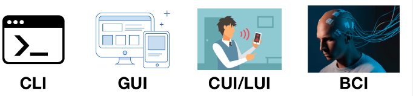
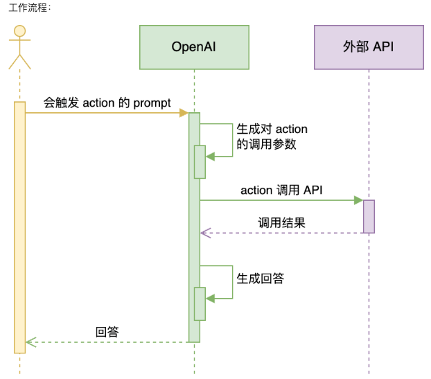
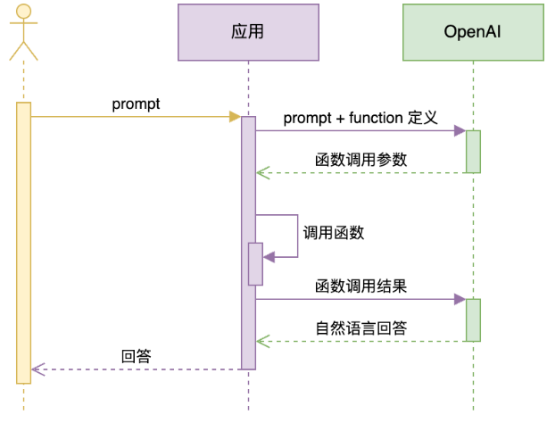
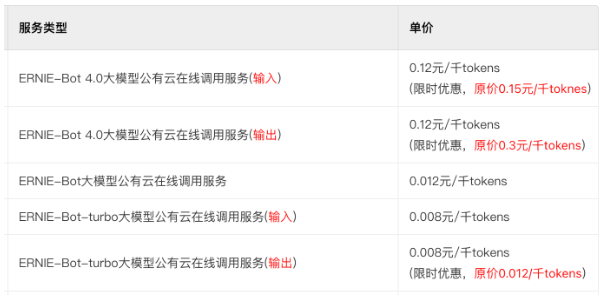

# Function Calling

1. 用自然语言连接系统的认知，面向未来思考系统间的集成
2. GPTs 是如何连接外部世界的
3. 用 Function Calling 把大模型和业务连接起来

## 接口(Interface)

两种常见接口：

1. 人机交互接口，User Interface，简称 UI
2. 应用程序编程接口，Application Programming Interface，简称 API

接口能「通」的关键，是两边都要遵守约定。

- 人要按照 UI 的设计来操作。UI 的设计要符合人的习惯
- 程序要按照 API 的设计来调用。API 的设计要符合程序惯例

我们会有很多调接口的痛苦经历？比如：

- 文档坑
- 大小写坑
- 参数顺序坑
- 参数类型坑
- ....

## 接口的进化

UI 进化的趋势是：越来越适应人的习惯，越来越自然

1. 命令行，Command Line Interface，简称 CLI（DOS、Unix/Linux shell, Windows Power Shell）
2. 图形界面，Graphical User Interface，简称 GUI（Windows、MacOS、iOS、Android）
3. 语言界面，Conversational User Interface，简称 CUI，或 Natural-Language User Interface，简称 LUI ← 我们在这里
4. 脑机接口，Brain–Computer Interface，简称 BCI



API：

1. 从本地到远程，从同步到异步，媒介发生很多变化，但本质一直没变：程序员的约定
2. 现在，开始进化到自然语言接口，Natural-Language Interface，简称 NLI

## 自然语言连接一切（Natural Language Interface）

NLI 是我们在《[以 ChatGPT 为代表的「大模型」会是多大的技术革命？](https://mp.weixin.qq.com/s/t0Ml7E-CvlKfdaUMBGKJBg)》一文中提出的概念。

```yaml
用户操作习惯的迁移，会逼所有软件，都得提供「自然语言界面（Natural Language Interface，简称 NLI）」。这是我生造的词，指的是以自然语言为输入的接口。

不仅用户界面要 NLI，API 也要 NLI 化。这是因为用户发出的宏观指令，往往不会是一个独立软件能解决的，它需要很多软件、设备的配合。

一种实现思路是，入口 AI（比如 Siri、小爱同学，机器人管家）非常强大，能充分了解所有软件和设备的能力，且能准确地把用户任务拆解和分发下去。这对入口 AI 的要求非常高。

另一种实现思路是，入口 AI 收到自然语言指令，把指令通过 NLI 广播出去（也可以基于某些规则做有选择的广播，保护用户隐私），由各个软件自主决策接不接这个指令，接了要怎么做，该和谁配合。

……

当 NLI 成为事实标准，那么互联网上软件、服务的互通性会大幅提升，不再受各种协议、接口的限制。
```

最自然的接口，就是自然语言接口：

以前因为计算机处理不对自然语言，所以有了那么多编程语言，那么多接口，那么多协议，那么多界面风格。而且，它们每一次进化，都是为了「更自然」。现在，终极的自然，到来了。我们终于可以把计算机当人看了！

OpenAI 是如何用自然语言连接一切的呢？

## 为什么要大模型连接外部世界？

```yaml
大模型两大缺陷：
  1.并非知晓一切
      训练数据不可能什么都有。垂直、非公开数据必有欠缺
      不知道最新信息。大模型的训练周期很长，且更新一次耗资巨大，还有越训越傻的风险。所以 ta 不可能实时训练。GPT-3.5 的知识截至 2022 年 1 月，GPT-4 是 2023 年 4 月。
  2.没有「真逻辑」。它表现出的逻辑、推理，是训练文本的统计规律，而不是真正的逻辑。
所以：大模型需要连接真实世界，并对接真逻辑系统。
```
比如算加法：

1. 把 100 以内所有加法算式都训练给大模型，ta 就能回答 100 以内的加法算式
2. 如果问 ta 更大数字的加法，就不一定对了
3. 因为 ta 并不懂「加法」，只是记住了 100 以内的加法算式的统计规律
4. Ta 是用字面意义做数学

数学能力最强的软件系统是 Wolfram Alpha，推荐阅读这篇文章了解它和 ChatGPT 原理的不同：[《Wolfram|Alpha as the Way to Bring Computational Knowledge Superpowers to ChatGPT》](https://writings.stephenwolfram.com/2023/01/wolframalpha-as-the-way-to-bring-computational-knowledge-superpowers-to-chatgpt/)

Wolfram 的书《[这就是 ChatGPT！](https://item.jd.com/13790739.html?cu=true&utm_source=learn.agiclass.cn&utm_medium=jingfen&utm_campaign=t_1002573986_&utm_term=4615b0f52e2c46dc901d7c9aea6864e8)》是从神经网络层面解释大模型原理的最好读的书。[英文版](https://writings.stephenwolfram.com/2023/02/what-is-chatgpt-doing-and-why-does-it-work/)免费

## OpenAI 用 Actions 连接外部世界

第一次尝试用 Plugins 连接真实世界，但产品很不成功，原因：

1. 不在「场景」中，不能提供端到端一揽子服务
2. 缺少「强 Agent」调度，只能手工选三个 plugin，使用成本太高
第二次尝试，升级为 Actions，内置到 GPTs 中，解决了落地场景问题。

小瓜 GPT 已经接入了高德地图 actions，可以试试问位置相关的问题：https://chat.openai.com/g/g-DxRsTzzep-xiao-gua


## Actions 开发对接

Actions 官方文档：https://platform.openai.com/docs/actions

把 API 对接到 GPTs 里，只需要配置一段 API 描述信息：
```yaml
openapi: 3.1.0
info:
  title: 高德地图
  description: 获取 POI 的相关信息
  version: v1.0.0
servers:
  - url: https://restapi.amap.com/v5/place
paths:
  /text:
    get:
      description: 根据POI名称，获得POI的经纬度坐标
      operationId: get_location_coordinate
      parameters:
        - name: keywords
          in: query
          description: POI名称，必须是中文
          required: true
          schema:
            type: string
        - name: region
          in: query
          description: POI所在的区域名，必须是中文
          required: false
          schema:
            type: string
      deprecated: false
  /around:
    get:
      description: 搜索给定坐标附近的POI
      operationId: search_nearby_pois
      parameters:
        - name: keywords
          in: query
          description: 目标POI的关键字
          required: true
          schema:
            type: string
        - name: location
          in: query
          description: 中心点的经度和纬度，用逗号分隔
          required: false
          schema:
            type: string
      deprecated: false
components:
  schemas: {}
```
还需要配置 API key 来满足权限要求。


这里的所有 name、description 都是 prompt，决定了 GPT 会不会调用你的 API，调用得是否正确。

思考：为什么不干脆整个描述文件都用自然语言写？非要用结构化的 JSON 或 YAML？
提高准确度 防止歧义

## GPTs 与它的平替们
[OpenAI GPTs](https://chat.openai.com/auth/login?next=%2Fgpts)

1. 无需编程，就能定制个性对话机器人的平台
2. 可以放入自己的知识库，实现 RAG（后面会讲）
3. 可以通过 actions 对接专有数据和功能
4. 内置 DALL·E 3 文生图和 Code Interpreter 能力
5. 只有 ChatGPT Plus 会员可以使用

两款平替：

[字节跳动 Coze](https://www.coze.com/)

1. 可以免科学上网，免费使用 GPT-4 等 OpenAI 的服务！大羊毛！
2. 只有英文界面，但其实对中文更友好
3. Prompt 优化功能更简单直接

[Dify](https://dify.ai/)

1. 开源，中国公司开发
2. 功能最丰富
3. 可以本地部署，支持非常多的大模型
4. 有 GUI，也有 API

有这类无需开发的工具，为什么还要学大模型开发技术呢？

1. 它们都无法针对业务需求做极致调优
2. 它们和其它业务系统的集成不是特别方便

Function Calling 技术可以把自己开发的大模型应用和其它业务系统连接。

## Function Calling 的机制

Function Calling 完整的官方接口文档：https://platform.openai.com/docs/guides/gpt/function-calling

值得一提： 接口里叫 tools，是从 functions 改的。这是一个很有趣的指向

## Demo1: 调用本地函数

需求：实现一个回答问题的 AI。题目中如果有加法，必须能精确计算。

详细见：call_local_func.py

**划重点**：
1. Function Calling 中的函数与参数的描述也是一种 Prompt
2. 这种 Prompt 也需要调优，否则会影响函数的召回、参数的准确性，甚至让 GPT 产生幻觉

## Demo2: 多函数调用

需求：查询某个地点附近的酒店、餐厅、景点等信息。即，查询某个 POI 附近的 POI。

详细见：call_local_funcs.py

## Demo3: 用 Function Calling 获取 JSON 结构

Function calling 生成 JSON 的稳定性比较高。

第一课中的例子：从一段文字中抽取联系人姓名、地址和电话

详细见：call_local_func_json.py

用最新的 [JSON Mode](https://platform.openai.com/docs/guides/text-generation/json-mode)，也可以不用 function calling 而获得稳定的 JSON 输出。

## Demo4: 通过 Function Calling 查询数据库

需求：从订单表中查询各种信息，比如某个用户的订单数量、某个商品的销量、某个用户的消费总额等等。

详细见：call_local_func_db.py

## Demo5: 通过 Function Calling 实现多表查询

在call_local_func_db.py中修改代码，实现多表查询。
描述数据库表结构

```sql
database_schema_string = """
CREATE TABLE customers (
    id INT PRIMARY KEY NOT NULL, -- 主键，不允许为空
    customer_name VARCHAR(255) NOT NULL, -- 客户名，不允许为空
    email VARCHAR(255) UNIQUE, -- 邮箱，唯一
    register_time TIMESTAMP DEFAULT CURRENT_TIMESTAMP -- 注册时间，默认为当前时间
);
CREATE TABLE products (
    id INT PRIMARY KEY NOT NULL, -- 主键，不允许为空
    product_name VARCHAR(255) NOT NULL, -- 产品名称，不允许为空
    price DECIMAL(10,2) NOT NULL -- 价格，不允许为空
);
CREATE TABLE orders (
    id INT PRIMARY KEY NOT NULL, -- 主键，不允许为空
    customer_id INT NOT NULL, -- 客户ID，不允许为空
    product_id INT NOT NULL, -- 产品ID，不允许为空
    price DECIMAL(10,2) NOT NULL, -- 价格，不允许为空
    status INT NOT NULL, -- 订单状态，整数类型，不允许为空。0代表待支付，1代表已支付，2代表已退款
    create_time TIMESTAMP DEFAULT CURRENT_TIMESTAMP, -- 创建时间，默认为当前时间
    pay_time TIMESTAMP -- 支付时间，可以为空
);
"""
```

## Demo6: Function Calling 使用 Stream 模式

流式（stream）输出不会一次返回完整 JSON 结构，所以需要拼接后再使用。

call_local_func.py 中的函数调用，改为 stream 模式。 stream=True 启动流式输出

## Function Calling 的注意事项

**划重点**：
  1. 只有 gpt-3.5-turbo-1106 和 gpt-4-1106-preview 可用本次课介绍的方法
  2. gpt-3.5-turbo 是 gpt-3.5-turbo-1106 的别名
  3. gpt-4 和 gpt-4-1106-preview 是两个不同的模型
  4. OpenAI 针对 Function Calling 做了 fine-tuning，以尽可能保证函数调用参数的正确。机理后面课时会讲
  5. 函数声明是消耗 token 的。要在功能覆盖、省钱、节约上下文窗口之间找到最佳平衡
  6. Function Calling 不仅可以调用读函数，也能调用写函数。但[官方强烈建议](https://platform.openai.com/docs/guides/function-calling/introduction)，在写之前，一定要有人做确认

## 支持 Function Calling 的国产大模型
- Function Calling 会成为所有大模型的标配，支持它的越来越多
- 不支持的大模型，某种程度上是不大可用的

### 百度文心大模型

官方文档：https://cloud.baidu.com/doc/WENXINWORKSHOP/index.html

百度文心系列大模型有三个。按发布时间从早到晚是：

1. ERNIE-Bot - 支持 Function Calling
2. ERNIE-Bot-turbo
3. ERNIE-Bot 4.0 - 支持 Function Calling（暂时白名单制）

从价格看区别：


### MiniMax

官方文档：https://api.minimax.chat/document/guides/chat-pro?id=64b79fa3e74cddc5215939f4

- 这是个公众不大知道，但其实挺强的大模型，尤其角色扮演能力
- 如果你曾经在一个叫 Glow 的 app 流连忘返，那么你已经用过它了
- 应该是最早支持 Function Calling 的国产大模型
- Function Calling 的 API 和 OpenAI 1106 版之前完全一样，但其它 API 有很大的特色

### ChatGLM3-6B

官方文档：https://github.com/THUDM/ChatGLM3/blob/main/tool_using/README.md

- 最著名的国产开源大模型，生态最好
- 早就使用 tools 而不是 function 来做参数，其它和 OpenAI 1106 版之前完全一样

### 讯飞星火 3.0

官方文档：https://www.xfyun.cn/doc/spark/Web.html#_2-function-call%E8%AF%B4%E6%98%8E

和 OpenAI 1106 版之前完全一样

## Function Calling 的想象空间

想象你是下面产品的研发，怎样用 Function Calling 实现下面的功能？

1. 对着微信说：「给我每个好友发一条情真意切的拜年消息，还要带点儿小幽默」
2. 对着富途牛牛说：「人工智能相关股票，市盈率最低的是哪几个？最近交易量如何？都有哪些机构持有？」
3. 对着京东说：「我想买一台 65 寸的电视，不要日货，价格在 5000 元左右」

基本上：

1. 我们的任何功能都可以和大模型结合，提供更好的用户体验
2. 通过大模型，完成内部功能的组合调用，完全 agent 化设计系统架构

当然，「幻觉」仍然是存在的。如何尽量减少幻觉的影响，参考以下资料：

- 自然语言生成中关于幻觉研究的综述：https://arxiv.org/abs/2202.03629
- 语言模型出现的幻觉是如何滚雪球的：https://arxiv.org/abs/2305.13534
- ChatGPT 在推理、幻觉和交互性上的评估：https://arxiv.org/abs/2302.04023
- 对比学习减少对话中的幻觉：https://arxiv.org/abs/2212.10400
- 自洽性提高了语言模型的思维链推理能力：https://arxiv.org/abs/2203.11171
- 生成式大型语言模型的黑盒幻觉检测：https://arxiv.org/abs/2303.08896

**NLP 算法工程师视角：**

1. 模型砍大面，规则修细节
2. 一个模型搞不定的问题，拆成多个解决
3. 评估算法的准确率（所以要先有测试集，否则别问「能不能做」）
4. 评估 bad case 的影响面
5. 算法的结果永远不是100%正确的，建立在这个假设基础上推敲产品的可行性


