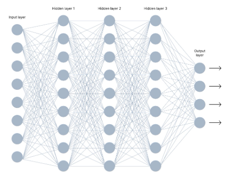
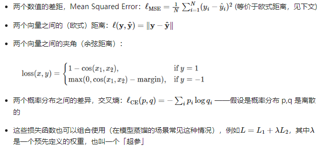

# Fine-Tuning

```yaml
面向初学者的深度学习课：
吴恩达《人人 AI》(特别通俗) https://www.zhihu.com/education/video-course/1556316449043668992
李沐的深度学习课 (稍微深一点) https://www.zhihu.com/education/video-course/1647604835598092705
在这个更广泛的定位上，已经有很多优秀的课程。本课程只针对大模型微调的知识基础展开。
```

## 一、微调的基本概念

### 1.1 工具：介绍一个模型训练利器 Hugging Face

- 官网：http://www.huggingface.co
- 相当于面向 NLP 模型的 Github
- 尤其基于 transformer 的开源模型非常全
- 封装了模型、数据集、训练器等，使模型的下载、使用、训练都非常方便

安装依赖：

```bash
pip install transformers
```

### 1.2 操作流程


### 例：使用 Hugging Face 的模型进行情感分类

Sentiment_classification.py

#### 1.2.1 导入库

```python
import datasets
from datasets import load_dataset
from transformers import AutoTokenizer, AutoModel
from transformers import AutoModelForCausalLM
from transformers import TrainingArguments, Seq2SeqTrainingArguments
from transformers import Trainer, Seq2SeqTrainer
import transformers
from transformers import DataCollatorWithPadding
from transformers import TextGenerationPipeline
import torch
import numpy as np
import os, re
from tqdm import tqdm
import torch.nn as nn
```

#### 1.2.2 加载数据集

通过HuggingFace，可以指定数据集名称，运行时自动下载

```python
# 数据集名称
DATASET_NAME = "rotten_tomatoes"

# 加载数据集
raw_datasets = load_dataset(DATASET_NAME)

# 训练集
raw_train_dataset = raw_datasets["train"]

# 验证集
raw_valid_dataset = raw_datasets["validation"]
```

#### 1.2.3 加载模型

```python
# 模型名称
MODEL_NAME = "gpt2"

# 加载模型 
model = AutoModelForCausalLM.from_pretrained(MODEL_NAME, trust_remote_code=True)
```

#### 1.2.4 加载 Tokenizer

通过HuggingFace，可以指定模型名称，运行时自动下载对应Tokenizer

```python
# 加载tokenizer
tokenizer = AutoTokenizer.from_pretrained(MODEL_NAME, trust_remote_code=True)
tokenizer.add_special_tokens({'pad_token': '[PAD]'})
tokenizer.pad_token_id = 0
# 其它相关公共变量赋值

# 设置随机种子：同个种子的随机序列可复现
transformers.set_seed(42)

# 标签集
named_labels = ['neg', 'pos']

# 标签转 token_id
label_ids = [
    tokenizer(named_labels[i], add_special_tokens=False)["input_ids"][0]
    for i in range(len(named_labels))
]
```

#### 1.2.5 处理数据集：转成模型接受的输入格式

- 拼接输入输出：<INPUT TOKEN IDS><EOS_TOKEN_ID><OUTPUT TOKEN IDS>
- PAD成相等长度：
  <INPUT 1.1><INPUT 1.2>...<EOS_TOKEN_ID><OUTPUT TOKEN IDS><PAD>...<PAD>
  <INPUT 2.1><INPUT 2.2>...<EOS_TOKEN_ID><OUTPUT TOKEN IDS><PAD>...<PAD>
- 标识出参与 Loss 计算的 Tokens (只有输出 Token 参与 Loss 计算)
  <-100><-100>...<OUTPUT TOKEN IDS><-100>...<-100>

```python
MAX_LEN = 32  # 最大序列长度（输入+输出）
DATA_BODY_KEY = "text"  # 数据集中的输入字段名
DATA_LABEL_KEY = "label"  # 数据集中输出字段名


# 定义数据处理函数，把原始数据转成input_ids, attention_mask, labels
def process_fn(examples):
    model_inputs = {
        "input_ids": [],
        "attention_mask": [],
        "labels": [],
    }
    for i in range(len(examples[DATA_BODY_KEY])):
        inputs = tokenizer(examples[DATA_BODY_KEY][i], add_special_tokens=False)
        label = label_ids[examples[DATA_LABEL_KEY][i]]
        input_ids = inputs["input_ids"] + [tokenizer.eos_token_id, label]

        raw_len = len(input_ids)
        input_len = len(inputs["input_ids"]) + 1

        if raw_len >= MAX_LEN:
            input_ids = input_ids[-MAX_LEN:]
            attention_mask = [1] * MAX_LEN
            labels = [-100] * (MAX_LEN - 1) + [label]
        else:
            input_ids = input_ids + [tokenizer.pad_token_id] * (MAX_LEN - raw_len)
            attention_mask = [1] * raw_len + [0] * (MAX_LEN - raw_len)
            labels = [-100] * input_len + [label] + [-100] * (MAX_LEN - raw_len)
        model_inputs["input_ids"].append(input_ids)
        model_inputs["attention_mask"].append(attention_mask)
        model_inputs["labels"].append(labels)
    return model_inputs
```

```python
# 处理训练数据集
tokenized_train_dataset = raw_train_dataset.map(
    process_fn,
    batched=True,
    remove_columns=raw_train_dataset.columns,
    desc="Running tokenizer on train dataset",
)

# 处理验证数据集
tokenized_valid_dataset = raw_valid_dataset.map(
    process_fn,
    batched=True,
    remove_columns=raw_valid_dataset.columns,
    desc="Running tokenizer on validation dataset",
)
```

#### 1.2.6 定义数据规整器：训练时自动将数据拆分成 Batch

```python
# 定义数据校准器（自动生成batch）
collater = DataCollatorWithPadding(
    tokenizer=tokenizer, return_tensors="pt",
)
```

#### 1.2.7 定义训练参数

```python
LR = 2e-5  # 学习率
BATCH_SIZE = 8  # Batch大小
INTERVAL = 100  # 每多少步打一次 log / 做一次 eval

# 定义训练参数
training_args = TrainingArguments(
    output_dir="./output",  # checkpoint保存路径
    evaluation_strategy="steps",  # 按步数计算eval频率
    overwrite_output_dir=True,
    num_train_epochs=1,  # 训练epoch数
    per_device_train_batch_size=BATCH_SIZE,  # 每张卡的batch大小
    gradient_accumulation_steps=1,  # 累加几个step做一次参数更新
    per_device_eval_batch_size=BATCH_SIZE,  # evaluation batch size
    eval_steps=INTERVAL,  # 每N步eval一次
    logging_steps=INTERVAL,  # 每N步log一次
    save_steps=INTERVAL,  # 每N步保存一个checkpoint
    learning_rate=LR,  # 学习率
)
```

#### 1.2.8 定义训练器

```python
# 节省显存
model.gradient_checkpointing_enable()

# 定义训练器
trainer = Trainer(
    model=model,  # 待训练模型
    args=training_args,  # 训练参数
    data_collator=collater,  # 数据校准器
    train_dataset=tokenized_train_dataset,  # 训练集
    eval_dataset=tokenized_valid_dataset,  # 验证集
    # compute_metrics=compute_metric,         # 计算自定义评估指标
)
```

#### 1.2.9 训练模型

```python
# 开始训练
trainer.train()
```

## 总结上述过程

1. 加载数据集
2. 数据预处理：

- 将输入输出按特定格式拼接
- 文本转 Token IDs
- 通过 labels 标识出哪部分是输出（只有输出的 token 参与 loss 计算）

3. 加载模型、Tokenizer
4. 定义数据规整器
5. 定义训练超参：学习率、批次大小、...
6. 定义训练器
7. 开始训练

**划重点**

- 记住上面的流程，你就能跑通模型训练过程
- 理解下面的知识，你就能训练好模型效果

## 二、什么是模型

### 2.1 模型的本质

通俗（不严谨）的说、模型是一个函数 f(x;w) = y

- x：输入 表示成一个数学「矩阵」（其实应该叫张量，tensor）
- w：模型参数
- y：输出 可以是「是否」（{0,1}）、标签（{0,1,2,3...}）、一个数值（回归问题）、下一个词的概率 ...
- f：表达式

```yaml
把它想象成一个方程：
1.每条数据就是一对儿(x,y)，它们是常量
2.参数是未知数，是变量
3.F就是表达式：我们不知道真实的公式是什么样的，所以假设了一个足够复杂的公式（比如，一个特定结构的神经网络）
4.这个求解这个方程（近似解）就是训练过程
```

```yaml
通俗的讲： 训练，就是确定这组参数的取值
· 用数学（数值分析）方法找到使模型在训练集上表现足够好的一个值
· 表现足够好，就是说，对每个数据样本(x,y)，使F(x;w)的值尽可能接近y 
```

### 2.2 简单的神经网络模型

一个神经元 y = f(Eiwi·xi)


多个神经元组成的网络，简称神经网络 y = f(Eiwi·xi)、z = f(Ejwj·yj)、...



这里的 f叫激活函数，有很多种形式

大模型中常用的激活函数包括：ReLU、GELU、Swish


## 三、模型训练的本质

我们希望找到一组参数 w，使模型预测的输出 y=F（x;w）与真实的输出 y，尽可能的接近


### 3.1 模型训练本质上是一个求解最优化问题的过程


### 3.2 如何求解

- 梯度定义


- 梯度下降法


梯度决定了函数变化的方向，每次迭代更新我们会收敛到一个极值


### 3.3 问题一 在整个数据集上求梯度，计算量太大


**经验**

- 如果全量参数训练：条件允许的情况下，先尝试Batch Size大些
- 小参数量微调：Batch Size 大不一定就好，看稳定性

### 3.4 问题二 深度学习没有全局最优解（非凸问题）


### 3.5 问题三 学习率也很关键，甚至需要动态调整


**划重点：适当调整学习率（Learning Rate），避免陷入很差的局部解或者跳过了好的解**

## 四、求解器

为了让训练过程更好的收敛，人们设计了很多更复杂的求解器

- 比如：SGD、L-BFGS、Rprop、RMSprop、Adam、AdamW、AdaGrad、AdaDelta 等等
- 但是，好在对于Transformer最常用的就是 Adam 或者 AdamW

## 五、常用的损失函数




