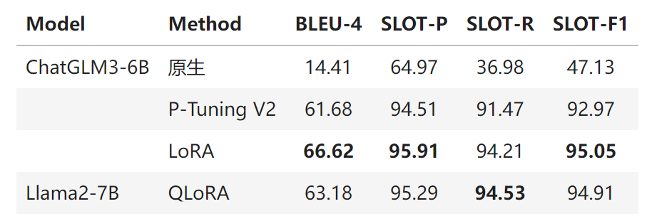

## 八、什么是训练/预训练/微调/轻量化微调？

- 模型训练（Training）
- 预训练（Pre-Training）
- 微调（Fine-Tuning）
- 轻量化微调（Parameter Efficient Fine-Tuning, PEFT）


- MNIST手写体识别实验，就是 Training
- 电影评论情感分类实验，就是 Fine-Tuning

### Pretraing 代码参考

- 不大的模型：以 GPT-2 模型为例
    - 第一步：训练 Tokenizer，代码参考：train_tokenizer.py
    - 第二步：预训练模型，代码参考：pretrain_gpt2.py
    - 训练条件：8 * A100(40G) GPUs，训练时间约2周
- 大语言模型：[OLMo](https://github.com/allenai/OLMo)
    - 开源了预训练一个 LLM 的完整过程和数据集

## 九、Transformer结构简介？

Transformer 是组成 LLM 的基本单元。

一个 LLM 就是一个N层 Transformer 网络，例如 GPT-3.5 是96层。


### 9.1、Transformer内部结构简介


**全连接层**

- 位置编码（Positional Encoding）
- 激活函数是GELU 或 Swish

### 9.2、LM Head


```yaml
扩展阅读：
更详细的Transformer网络拆解（Encoder-Decoder）：https://jalammar.github.io/illustrated-transformer/
更详细的GPT模型拆解：https://jalammar.github.io/illustrated-gpt2/
```

## 十、轻量化微调


- 定义微调数据集加载器
- 定义数据处理函数
- 加载预训练模型：AutoModel.from_pretrained(MODEL_NAME_OR_PATH)
- 在预训练模型上增加任务相关输出层 （如果需要）
- 加载预训练 Tokenizer：AutoTokenizer.from_pretrained(MODEL_NAME_OR_PATH)
- **定义注入参数的方法**（见下文）
- 定义各种超参
- 定义 Trainer
- 定义 Evaluation Metric
- 开始训练

### 10.1、Prompt Tuning

- 在输入序列前，额外加入一组伪 Embedding 向量
- 只训练这组伪 Embedding，从而达到参数微调的效果


### 10.2、P-tuning

- 用一个生成器生成上述伪 Embedding
- 只有生成器的参数是可训练的


### 10.3、Prefix-Tuning

- 伪造前面的 Hidden States
- 只训练伪造的这个 Prefix


### 10.4、LoRA

- 在 Transformer 的参数矩阵上加一个低秩矩阵（A X B）
- 只训练 A，B
- 理论上可以把上述方法应用于 Transformer 中的任意参数矩阵，包括 Embedding 矩阵
- 通常应用于 Query, Value 两个参数矩阵


### 10.5、QLoRA


更多参考: https://huggingface.co/blog/hf-bitsandbytes-integration

QLoRA 引入了许多创新来在不牺牲性能的情况下节省显存：

- 4位 NormalFloat（NF4），一种对于正态分布权重而言信息理论上最优的新数据类型
- 双重量化，通过量化量化常数来减少平均内存占用
- 分页优化器，用于管理内存峰值

原文实现：单个48G的GPU显卡上微调65B的参数模型，保持16字节微调任务的性能

### 10.6、AdaLoRA

- 不预先指定可训练矩阵的秩
- 根据参数矩阵的重要性得分，在参数矩阵之间自适应地分配参数预算。

## 十一、实战

基于ChatGLM3或Llama2， 微调一个同时具有NLU和问答能力对话机器人

### 11.1、数据集

酒店预订场景 https://github.com/thu-coai/CrossWOZ

酒店数据库 https://github.com/thu-coai/CrossWOZ/blob/master/data/crosswoz/database/hotel_db.json

### 11.2、数据增强

- 从CrossWOZ数据集中抽取了只关于酒店的对话
- 利用ChatGPT进行如下修改和补充
    - 对设施的描述更口语化
        - “找一家有国际长途电话的酒店” -> “找一家能打国际长途的酒店”
    - 补充一定比例的多轮问答，和结束语对话（p=0.3）
        - 针对只提及一个酒店时的问答：“这个酒店的电话是多少”
        - 针对推荐多个酒店时的对比问答：“哪个酒店评分更高”
        - 结束语：“好的，祝您入住愉快”
    - 补充按酒店名（简称）、价格上限查询的对话（原数据中没有这类说法）

数据增强的代码参考 data_augmentation.zip

最终按8:1:1拆分训练集、验证集和测试

### 11.3、数据拼接基本方式


### 11.4、多轮对话怎么拼

#### chatGLM2的方式

```yaml
user: 你好
assistant: 有什么可以帮您
user: 你喜欢什么颜色
assistant: 喜欢黑色
user: 为什么
assistant: 因为黑色幽默
```

按照轮次，上述对话将被拆分成3个单独的样本

- 每个样本以之前的历史为输入
- 当前轮的回复为输出

```yaml
样本1

输入： [Round 0]\n 问:
  你好\n 答:

  输出： 有什么可以帮您

  样本2

输入： [Round 0]\n 问:
  你好\n 答:
    有什么可以帮您\n [Round 1]\n 问:
      你喜欢什么颜色\n 答:

  输出： 喜欢黑色

  样本3

输入： [Round 0]\n 问:
  你好\n 答:
    有什么可以帮您\n [Round 1]\n 问:
      你喜欢什么颜色\n 答:
        喜欢黑色\n [Round 2]\n 问:
          为什么\n 答:

  输出： 因为黑色幽默
```

#### chatGLM3的方式

因为CausalLM是一直从左往右预测的，我们可以直接在多轮对话中标识出多段输出。具体如下：

角色special token用于标识分隔出多轮对话，同时也可以防范注入攻击

<|system|> #系统提示词，指明模型可使用的工具等信息
<|user|> #用户输入，用户的指令
<|assistant|> #模型回复，或模型思考要做的事情
<|observation|> #工具调用、代码执行结果
注意：这里<|role|>这种是一个token，而不是一串文本，所以不能通过tokenizer.encode('<role>')来得到

角色后跟随的是metadata，对于function calling来说，metadata是调用的函数和相应参数；对其他角色的对话，metadata为空

- 多轮对话finetune时根据角色添加loss_mask
- 在一遍计算中为多轮回复计算loss

**参考**

- 官方讲解：https://www.bilibili.com/video/BV1uC4y1J7yA
- 数据格式部分约在 17'30"

#### 11.4.1 ChatGLM 3 的数据加载

实际应用中，我们只需要将上述数据，与ChatGLM 3的标准数据格式对齐，就可调用其原生的数据加载器，自动完成数据拼接

ChatGLM 3原生的数据加载器代码：https://github.com/THUDM/ChatGLM3/blob/main/finetune_chatmodel_demo/preprocess_utils.py

**重点**

1. 在 tools 字段中描述function和parameters的定义
2. 在 conversations 字段中组织对话轮次
3. 以 user 和 assistant 标识出用户输入与系统回复
4. 在 function call 的角色以 tool 标识，并填入 function 名称和参数
5. 以 observation 标识出 function 的返回结果

### 11.5、如何在 Llama 2 中实现类似 Function Calling 的效果

参考 ChatGLM 2 的实现方式

1. 我们自定义user、assistant、search、return四个前缀。
    - 因为只有一个 function，我们直接把 function 标识成 search
2. 每轮 assistant 和 search 前缀也由模型自动生成，我们以此判断是 function 还是文本回复
3. 类似 ChatGLM 2，我们以“[Round i]\n\n”标识轮数

**Function Call 的样例**

输入

[Round 0]

user: 你好，请帮我推荐一个提供无烟房的舒适型酒店可以吗？

输出

search: {"facilities": ["无烟房"], "type": "舒适型"}}

**文本回复的样例**

输入

[Round 0]

user: 你好，请帮我推荐一个提供无烟房的舒适型酒店可以吗？

search: {"facilities": ["无烟房"], "type": "舒适型"}}

[Round 1]

return: [{"name": "北京红驿栈酒店", "type": "舒适型", "address": "北京朝阳区东直门外春秀路太平庄10号(
主副楼在一幢建筑里)", "subway": "东直门地铁站E口", "phone": "010-64171066", "
facilities": ["公共区域和部分房间提供wifi", "宽带上网", "国际长途电话", "吹风机", "24小时热水", "暖气", "无烟房", "早餐服务", "接待外宾", "行李寄存", "叫醒服务"], "
price": 344.0, "rating": 4.7, "hotel_id": 51}, {"name": "维也纳国际酒店(北京广安门店)", "type": "舒适型", "address": "
北京西城区白广路7号", "subway": "广安门内地铁站C口", "phone": "010-83539988", "
facilities": ["酒店各处提供wifi", "宽带上网", "吹风机", "24小时热水", "中式餐厅", "会议室", "无烟房", "商务中心", "早餐服务", "洗衣服务", "行李寄存", "叫醒服务"], "
price": 553.0, "rating": 4.7, "hotel_id": 56}]}]

输出

assistant: 没问题，推荐你去北京红驿栈酒店和维也纳国际酒店(北京广安门店)，都挺好的。

### 11.6、变写代码

见：fine-tuning-lab-v4.zip

### 11.7、训练后，在测试集上的参考指标

1. 针对 Function Calling 的每个参数（即 Slot），我们评估准确率、召回率、F1值
2. 针对文本回复，我们评估输出文本与参考文本之间的 BLEU Score
3. 如果本该是 Function Calling 的轮次，模型回复了文本，则所有指标为 0，反之 BLEU Score 为 0



## 十二、数据准备与处理

### 12.1、数据采集

- 自然来源（如业务日志）：真实数据
- Web 抓取：近似数据
- 人造

### 12.2、数据标注

- 专业标注公司
- 众包
- 主动学习
- 设计产品时形态

### 12.3、数据清洗

- 去除不相关数据
- 去除冗余数据（例如重复的样本）
- 去除误导性数据（业务相关）

### 12.4、样本均衡性

- 尽量保证每个标签（场景/子问题）都有足够多的训练样本
- 每个标签对应的数据量尽量相当
    - 或者在保证每个标签样本充值的前提下，数据分布尽量接近真实业务场景的数据分布
- 数据不均衡时的策略
    - 数据增强：为数据不够类别造数据：（1）人工造；（2）通过模板生成再人工标注；（3）由模型自动生成（再人工标注/筛选）
    - 数据少的类别数据绝对数量也充足时，Downsample 一般比 Upsample 效果好
    - 实在没办法的话，在训练 loss 里加权（一般不是最有效的办法）
- 根据业务属性，保证其他关键要素的数据覆盖，例如：时间因素、地域因素、用户年龄段等

### 12.5、数据集构建

- 数据充分的情况下
    - 切分训练集（训练模型）、验证集（验证超参）、测试集（检验最终模型+超参的效果）
    - 以随机采样的方式保证三个集合的数据分布一致性
    - 在以上三个集合里都尽量保证各个类别/场景的数据覆盖
- 数据实在太少
    - 交叉验证

## Google 的 Gemma

https://deepinfra.com/google/gemma-7b-it

注：Gemma 不支持中文

思考： 大语言模型哪些特性最有用


